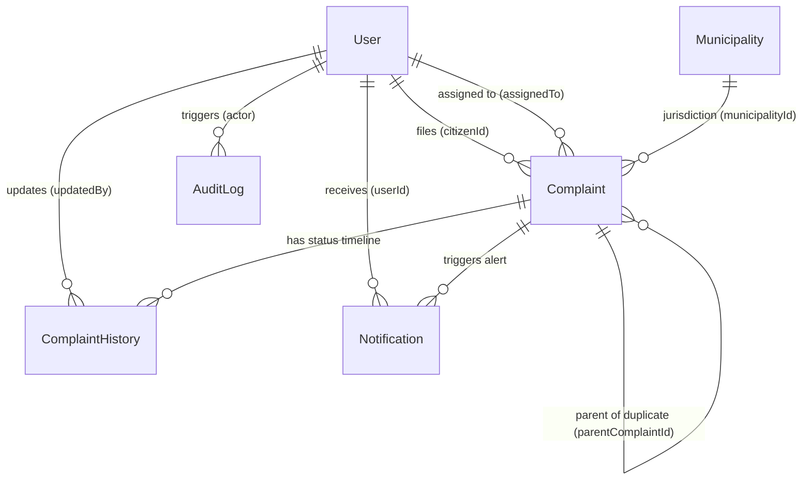

# FixMyRoad — Database Architecture & Data Foundation

## Overview

FixMyRoad Phase 3 establishes the MongoDB data layer via Mongoose. The database architecture is designed to support civic damage reporting, AI prediction metadata, GeoJSON spatial indexing, municipal boundary routing, status timeline tracking, notifications, and administrative audit logging.

---

## Entity-Relationship (ER) Diagram



---

## Models & Schemas Reference

### 1. `User` (`server/src/models/User.js`)
- `_id`: ObjectId
- `name`: String (required)
- `email`: String (required, unique, lowercased, indexed)
- `password`: String (hashed via bcrypt, `select: false`)
- `phone`: String
- `role`: Enum (`CITIZEN`, `MUNICIPALITY_ADMIN`, `SUPER_ADMIN`), default `CITIZEN`
- `isActive`: Boolean, default `true`
- `createdAt`, `updatedAt`: Timestamps

### 2. `Complaint` (`server/src/models/Complaint.js`)
- `_id`: ObjectId
- `complaintId`: String (unique, format `FMR-YYYY-00001`, e.g. `FMR-2026-00001`)
- `citizenId`: ObjectId (ref `User`, required)
- `imageUrl`: String
- `issueType`: Enum (`POTHOLE`, `ROAD_CRACK`, `BROKEN_ROAD`, `WATERLOGGING`, `OPEN_MANHOLE`, `DAMAGED_DIVIDER`, `MISSING_ROAD_SIGN`, `DAMAGED_STREET_LIGHT`, `OTHER`), default `OTHER`
- `aiConfidence`: Number (`0.0` to `1.0`), default `0`
- `severity`: Enum (`LOW`, `MEDIUM`, `HIGH`, `CRITICAL`), default `MEDIUM`
- `description`: String
- `location`: GeoJSON Point (`coordinates: [longitude, latitude]`, `2dsphere` indexed)
- `address`, `city`, `district`, `state`, `country`, `postalCode`: Reverse geocoding strings
- `municipalityId`: ObjectId (ref `Municipality`, default `null`)
- `status`: Enum (`SUBMITTED`, `UNDER_REVIEW`, `ACCEPTED`, `REJECTED`, `ASSIGNED`, `IN_PROGRESS`, `RESOLVED`, `CLOSED`), default `SUBMITTED`
- `reportCount`: Number (default `1`)
- `parentComplaintId`: ObjectId (ref `Complaint`, default `null`)
- `assignedTo`: ObjectId (ref `User`, default `null`)
- `resolutionComment`, `resolutionImage`: Resolution details
- `resolvedAt`: Date
- `createdAt`, `updatedAt`: Timestamps

### 3. `Municipality` (`server/src/models/Municipality.js`)
- `_id`: ObjectId
- `name`: String (required)
- `code`: String (unique, indexed, e.g. `MUN001`)
- `state`: String
- `district`: String
- `contactEmail`: String
- `contactPhone`: String
- `notificationMethod`: Enum (`EMAIL`, `SMS`, `API`, `DASHBOARD`, `MULTIPLE`), default `DASHBOARD`
- `boundary`: GeoJSON Polygon or MultiPolygon (`2dsphere` indexed)
- `active`: Boolean, default `true`
- `createdAt`, `updatedAt`: Timestamps

### 4. `ComplaintHistory` (`server/src/models/ComplaintHistory.js`)
- `_id`: ObjectId
- `complaintId`: ObjectId (ref `Complaint`, required)
- `oldStatus`: String
- `newStatus`: String (required)
- `updatedBy`: ObjectId (ref `User`, required)
- `comment`: String
- `timestamp`: Date, default `Date.now`

### 5. `Notification` (`server/src/models/Notification.js`)
- `_id`: ObjectId
- `userId`: ObjectId (ref `User`, required)
- `title`: String (required)
- `message`: String (required)
- `type`: Enum (`COMPLAINT_CREATED`, `STATUS_UPDATED`, `MUNICIPALITY_ASSIGNED`, `RESOLVED`, `REOPENED`, `SYSTEM`)
- `read`: Boolean, default `false`
- `relatedComplaintId`: ObjectId (ref `Complaint`, default `null`)
- `createdAt`: Timestamp

### 6. `AuditLog` (`server/src/models/AuditLog.js`)
- `_id`: ObjectId
- `actor`: ObjectId (ref `User`, required)
- `action`: String (e.g. `USER_CREATED`, `COMPLAINT_CREATED`, `COMPLAINT_STATUS_CHANGED`, `LOGIN`, `LOGOUT`)
- `entity`: String (required)
- `entityId`: ObjectId (default `null`)
- `metadata`: Mixed object
- `timestamp`: Date, default `Date.now`

### 7. `Counter` (`server/src/models/Counter.js`)
- `_id`: String (e.g. `complaint_2026`)
- `seq`: Number (atomic auto-increment count)

---

## GeoJSON Standard & Spatial Indexing

Coordinates MUST strictly follow the GeoJSON specification:

```javascript
location: {
  type: "Point",
  coordinates: [longitude, latitude] // Longitude FIRST, Latitude SECOND
}
```

### 2dsphere Indexes:
- `Complaint.location` (`2dsphere`) — Enables geospatial `$near`, `$geoWithin`, and duplicate proximity searches.
- `Municipality.boundary` (`2dsphere`) — Enables point-in-polygon jurisdiction lookup (`$geoIntersects`).

---

## Sequential Complaint ID Strategy

Complaint IDs use an atomic counter collection (`Counter.js`) and `findOneAndUpdate` with `$inc`:

```text
FMR-2026-00001
FMR-2026-00002
```

This guarantees thread-safe, conflict-free ID generation under high concurrent traffic.

---

## Database Management Commands

```bash
# Seed development municipal bodies (MUN001, MUN002, MUN003)
npm run seed:municipalities

# Inspect database document counts and active schema indexes
npm run db:inspect
```
